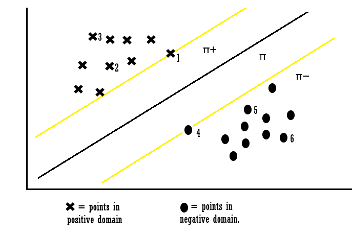

+++
# Documentation: https://sourcethemes.com/academic/docs/managing-content/

title = "Supprt Vector Machine (SVM)"
subtitle=  "Machine Learning Tool"
summary = "A Support Vector Machine (SVM) is a discriminative classifier formally defined by a separating hyperplane. In other words, given labeled training data (supervised learning), the algorithm outputs an optimal hyperplane which categorizes new examples. In two dimentional space this hyperplane is a line dividing a plane in two parts where in each class lay in either side"
authors = ["Shreshth Saini"]
tags = ["ML","SVM","Classification","Tool"]
categories = ["ML"]
date = 2020-03-02T15:22:25+05:30
lastmod = 2020-03-02T15:22:25+05:30
featured = false
draft = false

# Featured image
# To use, add an image named `featured.jpg/png` to your page's folder.
# Focal points: Smart, Center, TopLeft, Top, TopRight, Left, Right, BottomLeft, Bottom, BottomRight.
[image]
  caption = "Source: H. R. Baghaee et. al., Support Vector Machine-based Islanding and Grid Fault Detection in Active Distribution Networks."
  focal_point = "Top"
  preview_only = false

# Projects (optional).
#   Associate this post with one or more of your projects.
#   Simply enter your project's folder or file name without extension.
#   E.g. `projects = ["internal-project"]` references `content/project/deep-learning/index.md`.
#   Otherwise, set `projects = []`.
# projects: []
+++
### What does Support Vector Machines do?

Support Vector Machines are supervised learning models for classification and regression problems. They can solve linear and non-linear problems and work well for many practical problems. The idea of Support Vector Machines is simple: The algorithm creates a line which separates the classes in case e.g. in a classification problem. The goal of the line is to maximizing the margin between the points on either side of the so called decision line. The benefit of this process is, that after the separation, the model can easily guess the target classes (labels) for new cases.

Maybe you say now, that this probably only works for a low dimensional problem, e.g a data set with only 2 features, but that is wrong! Support Vector Machines are actually very effective in higher dimensional spaces. It is even very effective on data sets where number of dimensions is greater than the number of samples. This is mainly because of the kernel trick, which we talk about it later. Further advantages of Support Vector Machines are the memory efficiency, speed and general accuracy in comparison to other classification methods like k-nearest neighbor or deep neural networks. Of course they are not every time better than e.g. deep neural networks, but sometimes they still outperform deep neural networks. SVM is based on the idea of finding a hyperplane that best separates the features into different domains.

### Difference between Linear and Non-Linear Data

To clear everything up, I explain quickly what it is all about the linear and non-linear data thing. We talk about linear data, when we can classify the data with a linear classifier. The linear classifier makes his classification decision based on a linear combination of characteristics. The characteristics are also known as features in machine learning. The following picture will make things more clear.

In figure A we can separate the target labels linear with a line (like Support Vector Machines do classification with a decision line). A linear classifier can do this with a linear combination of characteristics. We could use e.g. Support Vector Machines do build a model, but we could also use many other linear classification methods like quadratic classification.
In figure B we can not separate the target labels linear. The data is more complex divided. Therefore we can not just use a linear classification method. Fortunately Support Vector Machines can do both, linear and non-linear classification. Lets first take an easier linear example to get an introduction about Support Vector Machines. Later we will look at non-linear classification with Support Vector Machines and we will see how it works with the kernel trick.

### *Intuition development*
Consider a situation following situation:
There is a stalker who is sending you emails and now you want to design a function( hyperplane ) which will clearly differentiate the two cases, such that whenever you received an email from the stalker it will be classified as a spam. The following are the figure of two cases in which the hyperplane are drawn, which one will you pick and why? take a moment to analyze the situation below. 

I guess you would have picked the fig(a). Did you think why have you picked the fig(a)? Because the emails in fig(a) are clearly classified and you are more confident about that as compared to fig(b). Basically, SVM is composed of the idea of coming up with an Optimal hyperplane which will clearly classify the different classes(in this case they are binary classes).
 
***Terminologies used in SVM:***
The points closest to the hyperplane are called as the support vector points and the distance of the vectors from the hyperplane are called the margins.

The basic intuition to develop over here is that more the farther SV points, from the hyperplane, more is the probability of correctly classifying the points in their respective region or classes. SV points are very critical in determining the hyperplane because if the position of the vectors changes the hyperplane’s position is altered. Technically this hyperplane can also be called as margin maximizing hyperplane.

***Hyperplane(Decision surface ):***
For so long in this post we have been discussing the hyperplane, let’s justify its meaning before moving forward. The hyperplane is a function which is used to differentiate between features. In 2-D, the function used to classify between features is a line whereas, the function used to classify the features in a 3-D is called as a plane similarly the function which classifies the point in higher dimension is called as a hyperplane. Now since you know about the hyperplane lets move back to SVM.

Let’s say there are “m” dimensions:
thus the equation of the hyperplane in the ‘M’ dimension can be given as =

where,
Wi = vectors(W0,W1,W2,W3……Wm),
b = biased term (W0), 
X = variables.

### Hard margin SVM:
Now,
Assume 3 hyperplanes namely (π, π+, π−) such that ‘π+’ is parallel to ‘π’ passing through the support vectors on the positive side and ‘π−’ is parallel to ‘π’ passing through the support vectors on the negative side.

the equations of each hyperplane can be considered as:

for the point X1 :

Explanation: when the point X1 we can say that point lies on the hyperplane and the equation determines that the product of our actual output and the hyperplane equation is 1 which means the point is correctly classified in the positive domain.
for the point X3:

Explanation: when the point X3 we can say that point lies away from the hyperplane and the equation determines that the product of our actual output and the hyperplane equation is greater 1 which means the point is correctly classified in the positive domain.
for the point X4:

Explanation: when the point X4 we can say that point lies on the hyperplane in the negative region and the equation determines that the product of our actual output and the hyperplane equation is equal to 1 which means the point is correctly classified in the negative domain.
for the point X6 :

Explanation: when the point X6 we can say that point lies away from the hyperplane in the negative region and the equation determines that the product of our actual output and the hyperplane equation is greater 1 which means the point is correctly classified in the negative domain.
Let’s look into the constraints which are not classified:

for point X7:

Explanation: When Xi = 7 the point is classified incorrectly because for point 7 the wT + b will be smaller than one and this violates the constraints. So we found the misclassification because of constraint violation. Similarly, we can also say for points Xi = 8.
Thus from the above examples, we can conclude that for any point Xi,
if Yi(WT*Xi +b) ≥ 1:
then Xi is correctly classified
else:
Xi is incorrectly classified.
So we can see that if the points are linearly separable then only our hyperplane is able to distinguish between them and if any outlier is introduced then it is not able to separate them. So these type of SVM is called as hard margin SVM (since we have very strict constraints to correctly classify each and every datapoint).

### Soft margin SVM:
We basically consider that the data is linearly separable and this might not be the case in real life scenario. We need an update so that our function may skip few outliers and be able to classify almost linearly separable points. For this reason, we introduce a new Slack variable ( ξ ) which is called Xi.
if we introduce ξ it into our previous equation we can rewrite it as

if ξi= 0,
the points can be considered as correctly classified.
else:
ξi> 0 , Incorrectly classified points.
so if ξi> 0 it means that Xi(variables)lies in incorrect dimension, thus we can think of ξi as an error term associated with Xi(variable). The average error can be given as;

thus our objective, mathematically can be described as;

where ξi = ςi

***This formulation is called the Soft margin technique.***

### Loss Function Interpretation of SVM:
it can be interpreted that hinge loss is max(0,1-Zi). 

when Zi is ≥ 1 then the loss is 0.
when Zi < 1 then loss increases.

### What is Kernel trick?
Coming to the major part of the SVM for which it is most famous, the kernel trick. The kernel is a way of computing the dot product of two vectors x and y in some (very high dimensional) feature space, which is why kernel functions are sometimes called “generalized dot product.

Applying kernel trick means just to the replace dot product of two vectors by the kernel function.

### *Using the Support Vector Machines for non-linear data with the kernel trick*
Until know we have talked about linear examples and how Support Vector Machines work and how you can implement them with sklearn in Python. I already talked a little bit about non-linear data. When there is a non-linear data set Support Vector Machines can not simply draw a linear hyperplane. Therefore Support Vector Machines use the kernel trick. When you have non-linear data, the kernel method helps you to find pattern and relations to reach a high accuracy in your final machine learning model.

### *How does the Kernel method works?*
The kernel method are contains are so called kernel function. These function map the non-linear separable input space into a higher dimensional linear separable feature space. And in this new higher dimensional linear separable feature space Support Vector Machines can work as normal. The kernel method then maps the solutions back, so that in the non-linear separable input space you then have a non-linear solution.

In the example above we have a two dimensional feature space, which is non-linear. With the kernel function we can map the input space into a three dimensional feature space. In this feature space we then can separate the training set linear. When we map the solution back to the input space we get a non-linear solution.

### Pros and cons of SVM:
***Pros:***
* It is really effective in the higher dimension
* Effective when the number of features are more than training examples
* Best algorithm when classes are separable
* The hyperplane is affected by only the support vectors thus outliers have less impact
* SVM is suited for extreme case binary classification
***cons:***
* For larger dataset, it requires a large amount of time to process
* Does not perform well in case of overlapped classes
* Selecting, appropriately hyperparameters of the SVM that will allow for sufficient generalization performance
* Selecting the appropriate kernel function can be tricky

### Preparing data for SVM:
1. Numerical Conversion:
SVM assumes that you have inputs are numerical instead of categorical. So you can convert them using one of the most commonly used “one hot encoding , label-encoding etc”.
2. Binary Conversion:
Since SVM is able to classify only binary data so you would need to convert the multi-dimensional dataset into binary form using (one vs the rest method / one vs one method) conversion method.

### REFERENCES:
* http://cs229.stanford.edu/notes/cs229-notes3.pdf (Andrew Ng’s notes on SVM)
* https://scikit-learn.org/stable/modules/generated/sklearn.svm.SVC.html (Sklearn page on SVM)