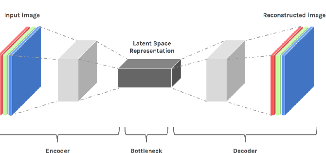
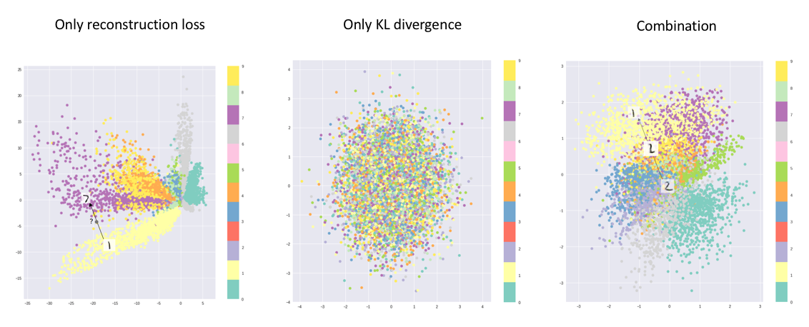

In the last few years deep learning practictioners have developed a huge interest in deep generative models. Credit for this can be given to availability of huge datasets, computational capacity, efficient optimization methods and well-designed networks. With all these, generative model are now able to produce realistic contents be it images, texts or voice/music. In this post I have tried to present my understandig of one such generative approach : Variational Auto-Encoder. 

### Auto-Encoders 
***Before we actually dive into the Variational autoencoders, lets have a clarity about what are autoencoders.*** 
Autoencoder are used for data compression and other derivative tasks such as segmentation, noise reduction, feature manipulation in image, etc.. Autoencoder consists of two part namely ***Encoder*** and ***Decoder***. Encoder(E) takes the input(X) and produces corresponding latent space representation(E(X)), output of encoder is then fed to decoder(D) which gives us our final output(D(E(X))). Autoencoder are trained supervisingly (X,Y). With convolutional autoencoder we can extract high dimensional representation of our data from latent space. No doubt autoencoder works better for limited applications. Encoders tend to map the data to a discontinuous latent space (i.e segregation of clusters at bottleneck). This specifically creates issue when we deploy these models for generative tasks which might require sampling and/or interpolation from latent space and which might create generate unrealistic outputs. 

*Fig. 1: Convolutional Autoencoder.[[1]](#1)*

### Variational Auto-Encoders(VAEs)
Having understood the basics of autoencoder and its structure now we can move towards the real thing. It it to be notes that latent space representations from simple autoencoder can not be used in generation task as it gives the a rather unrealistic output. Reason being distribution of latent space is often not continuous. Variational autonencoders introduce additional layers at bottleneck of the network to extract the probablistic distribution of the latent space (mean and standard deviation), in additional a KL-Divergence loss [[2]](#2) is also used to bring the data distribution close up for interpolation inbetween the classes (generation). In general results of VAE are blurry, novel loss functions such as generative loss [[3]](#3) or perceptual loss [[4]](#4) can be used to remove the blurriness.

*Fig. 2: Convolutional Variational Autoencoder. Low dimensional representation feature is sampled from learned distribution at bottlecneck. Unit gaussian distribution depicts convergence of learned distribution towards normal distribution.[[5]](#5)*

### About Mean and standard deviation
Vectors formed at bottlenck of the VAE network consists of parameteres where each element correspond to μ and σ of random variable Xi. From this vector we sample the encodings to be sent into the decoder. Beauty is, that every time we are generating samples rather than direct encodings of input data making sure that every encoding will be different. 

KL-loss trying to converge the distribution of latent space vectors towards normal distribution, μ depicting the central value of input distribution and σ looks into the covereged range (variation from actual encoding). Due to probabilistic distribution and not simple direct encodings decoder learns to generate same class from distribution of latent space. Model have smooth latent space given similar samples and class are close one another. To make sure that μ and σ doesn't attain extreme values such that clusters of classes are too far away, σ is kept minimized for efficient and realistic generation. 

*Fig. 3: Three images depcting the clusters shows how use of KL loss and reconstruction loss can form optimum clusters for VAE at bottleneck.[[6]](#6)*

### Loss and opitmization
As discussed above, for generation class must be closely clustered. Which is acheived using KL-divergence loss, it measures the divergence between the porbability distributions. Minimizing the loss, optimizes the μ and σ to bring closer to target distribution (ideal values μ and σ to be 0 and 1 respectively). All the samples are enoded by encoder to form a normal distribution at bottleneck. If we train our model using only KL loss then all the encodings will be randomly placed around the μ with no actual similarity between neary encodings, decoder generate randome outputs from this encodings. With reconstruction loss, meaningful sample encoding are kept nearby. Reconstruction loss have due to its nature tries to map similar classes as close as possible. 

### Beyond VAE

VAEs are limited to due to blurred reconstruction and limited generative capacity. Researchers have been exploited the other deep learning and pipelines for generation tasks, Generative Adversarial Networks. Many models have been proposed till the date which are being improved day by day as more and more efficient training strategies are coming up along with higher computational capacities. A list of GANs presented [here](https://github.com/hindupuravinash/the-gan-zoo). VAEs are great way of beginning with generative methodology but if you are more focused on generating sharp, confident, and realistic outputs then one should look for GANs or other deep learning methods. 

### REFERENCES:
<a id="1">[1]</a> 
[Tara Larrue and Xiaoxu Meng and Chang-Mu Han.
Denoising Videos with Convolutional Autoencoders A Comparison of Autoencoder Architectures, 2018.](https://www.cs.umd.edu/sites/default/files/scholarly_papers/Larrue,%20Tara_1801.pdf)

<a id="2">[2]</a> 
[Joyce, James M., Lovric, Miodrag.
Kullback-Leibler Divergence. International Encyclopedia of Statistical Science
Springer Berlin Heidelberg. 720--722, 978-3-642-04898-2. 2011
DOI:10.1007/978-3-642-04898-2_327](https://doi.org/10.1007/978-3-642-04898-2_327)

<a id="3">[3]</a> 
[Anders Boesen Lindbo Larsen, Søren Kaae Sønderby, Hugo Larochelle, Ole Winther. 
Autoencoding beyond pixels using a learned similarity metric. 2016](https://arxiv.org/abs/1512.09300)

<a id="4">[4]</a> 
[Xianxu Hou, Linlin Shen, Ke Sun, Guoping Qiu. 
Deep Feature Consistent Variational Autoencoder. 2016](https://arxiv.org/abs/1610.00291)

<a id="5">[5]</a> 
[Abhinav Prakash. 
Different types of Autoencoders. opengenus.org. 
University of Massachusetts, Amherst.](https://iq.opengenus.org/types-of-autoencoder/)

<a id="6">[6]</a> 
[JEREMY JORDAN. 
Variational autoencoders, Data Science. 2018](https://www.jeremyjordan.me/variational-autoencoders/)

